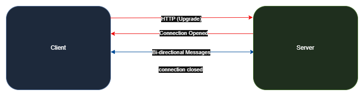
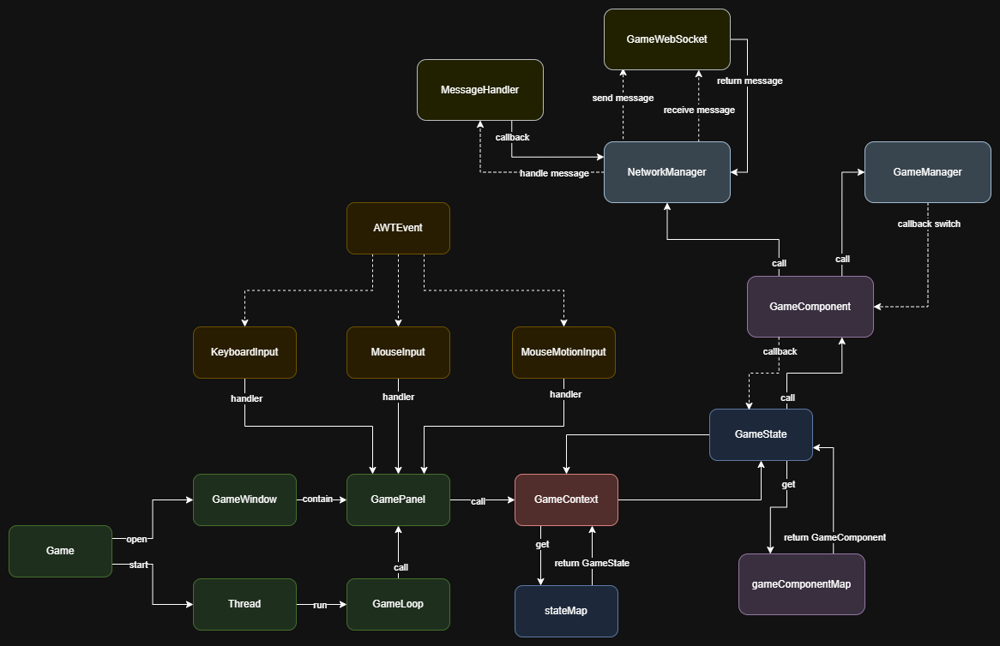
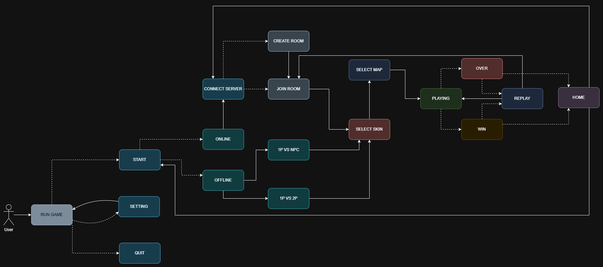
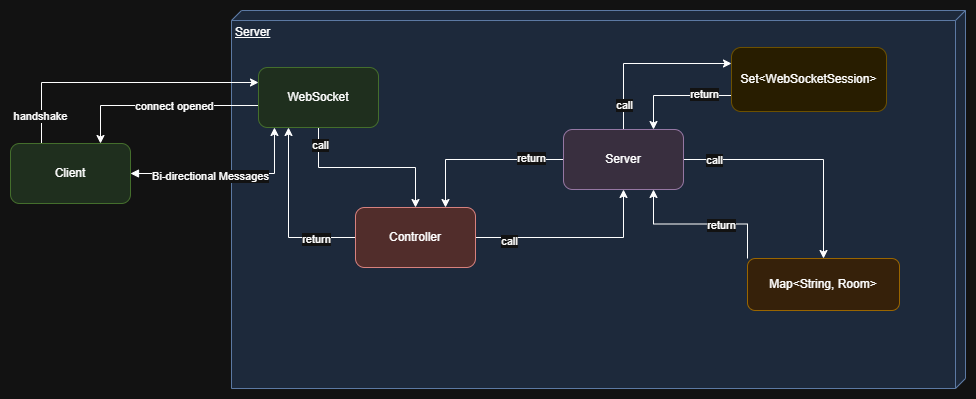

= Boom Battle Document
Long Nguyen Hoang <nghlong3004@gmail.com>
v1.0, 11-2025
:sectnums:
:toc:
:toclevels: 4
:source-highlighter: highlight.js

Author: {author} {email} +
Version: {revnumber} ({revdate})

'''

== Introduction

=== About the Game

Game Boom Battle được mình mô phỏng lại dựa trên tựa game Boom Online 2D. +
Khi tham gia trò chơi, người chơi sẽ điều khiển nhân vật bằng các nút di chuyển trên bàn phím Nhiệm vụ của người chơi là nhặt item, né bomb và đặt bomb để tiêu diệt đối thủ (gồm người chơi khác hoặc máy). +

NOTE: Mục tiêu của project là để cá nhân mình vận dụng những lý thuyết như Design Pattern, OOP, SOLID và giao thức WebSocket vào trong thực tế.

=== Installation

Để trải nghiệm bạn cần clone 2 repositories của mình.

[source,bash]
----
git clone https://github.com/nghlong3004/boom-battle-backend.git
----

[source,bash]
----
git clone https://github.com/nghlong3004/boom-battle-swing.git
----

Hoặc bạn chỉ cần clone https://github.com/nghlong3004/boom-battle-backend[*Boom Battle Backend*^].
Và tải file `.jar` cho client ở https://github.com/nghlong3004/boom-battle-swing/blob/main/out/artifacts/boom_battle_swing_jar/boom-battle-swing.jar[*đây*].

* Server: +
Bạn tìm file `BoomBattleBackendApplication.java` để chạy.
* Client: +
Bạn tìm file `BoomBattleSwing.java` để chạy hoặc vào terminal gõ:

[source,bash]
----
cd out\artifacts\boom_battle_swing_jar
java -jar boom-battle-swing
----

[IMPORTANT]
====
Để chạy dự án, bạn cần có Java 21 trở lên
====

== Design for Boom Battle

=== High Level Design

==== System Overview

Game theo dạng mô hình client-server. +
- `Client`: Java Swing (Java 21). +
- `Server`: Spring Boot (3.5.8). +
- `Protocol`: WebSocket (JSON). +
- `Game Type`: Offline, Online (real-time).

==== Requirements

.Functional
[cols="1, 3"]
|===
|Function| Short Description
|Connection
|Kết nối người chơi với server qua WebSocket.
|Disconnection
|Người chơi ngắt kết nối với Server
|Create Room
|Người chơi tạo phòng
|Room List
|Lấy danh sách phòng
|Join Room
|Người chơi tham gia phòng
|Leave Room
|Người chơi rời khỏi phòng
|Chat Message
|Người chơi gửi tin nhắn trong phòng
|Update Map, Skin, Ready
|Người chơi thay đổi skin, map và trạng thái ready
|Start Game
|Chủ phòng bắt đầu ván đấu
|Bomber Action
|Hành động của người chơi khi di chuyển

|===

.Non-Fuctional
[cols="1,3"]
|===
|Category | Requirement
|Hiệu năng
|Trong 1s sẽ update số UPS lần (khuyến nghị 200)
|===

==== Architecture Overview

==== Data Flow Diagram

* **Game Flow**:

* **User Flow**:

* **Client - Server Flow**:

==== Package Overview

.Client
[cols="1,2"]
|===
| Package | Responsibilities

| WebSocket
| Quản lý kết nối WebSocket, nhận/gửi message JSON

| AI
| Đưa ra quyết định cho Agent

| Game.Main
| Game loop, Game Panel, Game Frame, Game Window

| Game.Context
| Chứa các state là trạng thái của game như MENU, ONLINE, OFFLINE, OPTION

| Game.Component
| Thành phần nhỏ của các Bối cảnh game như Over, Win,etc...

| Game.Input
| Nơi lắng nghe các Input như keyboard, mouse

| Game.Manager
| Quản lý game như update gì, render cái gì, có những dữ liệu gì

| Assets
| Nơi chứa tài nguyên đảm bảo tài nguyên chỉ được loading lên 1 lần

| Model
| Chứa Entities, POJO và Data Transfer Object.

| Loader
| dùng để Load tài nguyên như ảnh, file audio

| Util
| Hỗ trợ check vị trí, map, ...

|===

.Server
[cols="1,2"]
|===
| Module | Responsibilities

| WebSocket
| Quản lý kết nối WebSocket, nhận/gửi message JSON

| Controller
| Điều hướng để xử lý data và trả về cho client

| Service
| Xử lý data

| Model
| Chứa Entities, POJO và Data Transfer Object.

| Configuration
| Chứa các class configuration

|===

== Low Level Design

=== Package Structure

[cols="3,5"]
|===
|Package | Short Description

|`io.nghlong3004.game.main`
| Thành phần khởi tạo (`GamePanel`, `GameFrame`, `GameWindow`), vòng lặp (`GameLoop`).

|`io.nghlong3004.game.context`
| context: `GameContext` +
các lớp state trong `state/`.

|`io.nghlong3004.game.manager`
| Game manager: `GameManager` +
Manager-sub (Map, Bomber, Bomb, Explosion, Item, Agent, Timer, Render, Network).

|`io.nghlong3004.model.entities`
| Thực thể gameplay (`Bomber`, `Bomb`, `Explosion`, `Item`).

|`io.nghlong3004.loader`
| Loader tài nguyên: ảnh, âm thanh, map, object.

|`io.nghlong3004.constant`
| Các hằng số tile, fps, asset path, kích thước.

|`io.nghlong3004.configuration`
| Các configuration.

|`io.nghlong3004.websocket`
| Client WebSocket (`BomberWebSocketClient`, `MessageHandler`).

|io.nghlong3004.model.request / response
| DTO send/receive qua WebSocket.

|`io.nghlong3004.util`
| Util check va chạm, âm thanh.

|`io.nghlong3004.ai`
| Điều hướng Agent.
|===

=== Class Design

* UI: `BoomBattleSwing.main()` -> `Game.run()`.
* `Game` Factory Init: `AudioLoader` -> `GameManager` -> `NetworkManager` -> `GameContext` -> `GamePanel` -> `GameLoop`.
* State Pattern: `GameContext` holder `EnumMap<GameStateType, GameState>`; forward method `update`, `render`, `input` -> `currentState`.
* Manager Facade: `GameManager` Manager lifecycle ván game:
** `MapManager`: load map, check spawn.
** `BomberManager`, `BombManager`, `ExplosionManager`, `ItemManager`: update & render.
** `AgentManager`: update Agent without tickMillis.
** `GameTimer`: Manager Timer (reset, start, update).
** `GameRender`: logic render.
* Entity Hierarchy: `Entity` (x, y, width, height, alive, skin, speed). +
`Bomber` added bomb slots, range, speed, flag bomb, animation dead (8 frames / speed 10 ticks).
* Configuration: `Configuration` (Singleton Holder) ->  `GameConstant` (TILE_SIZE, GAME_WIDTH/HEIGHT...).
* Thread: `GameLoop` .

=== WebSocket Protocol Detail

* Message Types (`MessageType` enum):
** Kết nối vòng đời: `CONNECT`, `DISCONNECT`.
** Phòng: `CREATE_ROOM`, `JOIN_ROOM`, `LEAVE_ROOM`, `ROOM_LIST`, `ROOM_UPDATE`, `START_GAME`.
** Gameplay: `BOMBER_ACTION`, `GAME_STATE_UPDATE`.
** Cập nhật thuộc tính: `UPDATE_READY`, `UPDATE_SKIN`, `UPDATE_MAP`.
** Chat: `CHAT_MESSAGE`.
** Lỗi: `ERROR`.
* Request DTO (client -> server):
** `CreateRoomRequest(owner, ownerName, name, maxBombers, mapType, skinType)`.
** `JoinRoomRequest(id, bomberInfo)` với `BomberInfo(id,name,skin,isReady)`.
** `ChatMessageRequest(roomId, owner, content)`.
** `BomberActionRequest(bomberId, keyCode, isReleased)`.
* Response / Data DTO (server -> client):
** `Room` : id, owner, name, danh sách `BomberInfo`, `maxBomber`, `map`, `chatMessages`.
** `MapDataResponse(map[][], spawns[])` +
Start added `StartGameResponse(mapData, itemSpawns[][])`.
** `PointResponse(x,y)` spawn.
* Chu trình điển hình:
** Client send `CREATE_ROOM` -> receive `ROOM_UPDATE`  -> các client cập nhật danh sách qua `ROOM_LIST`.
** Chủ phòng send `START_GAME` -> server phát `START_GAME` với `MapDataResponse` + `itemSpawns` -> client call `playOnline()`.
** Mỗi phím nhấn/thả: gửi `BOMBER_ACTION` -> server broadcast lại -> `NetworkManager.keyAction()` .

=== Game Loop Detail

* Hằng số: `FPS`, `UPS` lấy từ `GameConstant`.
SECOND = 1E9 ns.
* Công thức: `FRAMES_PER_NANO_TIME = SECOND / FPS`, tương tự cho UPDATE.
* Delta and Count: `frameDelta`, `updateDelta`, `secondDelta` (double) + đếm `frameCount`, `updateCount`.
* Trình tự:
** `updateTimer()`: tính elapsed ns, thêm vô delta.
** `processUpdate()`: while `updateDelta >= 1` -> `gamePanel.update()` -> `GameContext.update()` -> `currentState.update()` ->  `GameManager.update()`.
** `processRender()`: if `frameDelta >= 1` -> `gamePanel.repaint()` -> `paintComponent()` -> `GameContext.render()` -> `currentState.render()`.
** `displayFPSandUPS()`: reset count.

=== Map & Collision Handling

* Map Loading: `MapManager.loadMap(mapType)` -> gọi `MapLoader.loadMapFromFilePath(assetKey)` -> parse từng dòng thành int[].
* Spawn Extraction: tile == 6 được thêm vào `bomberSpawns` (tọa độ lưới).
Sau đó chuyển thành vị trí pixel căn giữa theo số cột/hàng của màn hình (dịch bởi `spaceX`, `spaceY`).
* Asset Tile: `MapLoader.loadMapAssets()` tạo ma trận sprite `[MapType][TileType]` với path template `MapConstant.IMAGE_PATH_TEMPLATE`.
* Centering: dịch spawn bằng nửa phần dư màn hình: `(MAX_SCREEN_COLUMN - mapWidth) >>> 1`, `(MAX_SCREEN_ROW - mapHeight) >>> 1`.
* Collision Conversion: `CollisionUtil.pixelToGridRow/Column(pixel, offset)` dựa trên `TILE_SIZE` để chuyển đổi.
* Item Spawns: nếu Offline random 60% tạo item (qua `GameManager.getItemTypes()`), online nhận từ server `StartGameResponse.itemSpawns`.
* Explosions & Bomb logic dựa trên grid align -> check (`SOFT_WALL`, `SOLID_WALL`).

